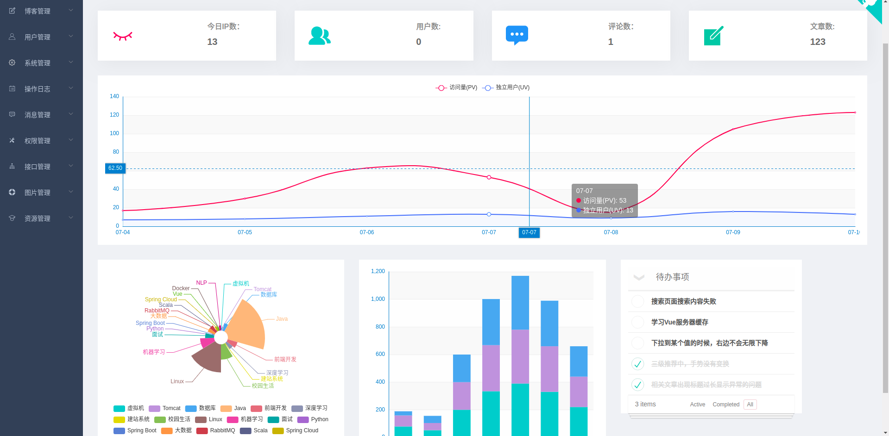
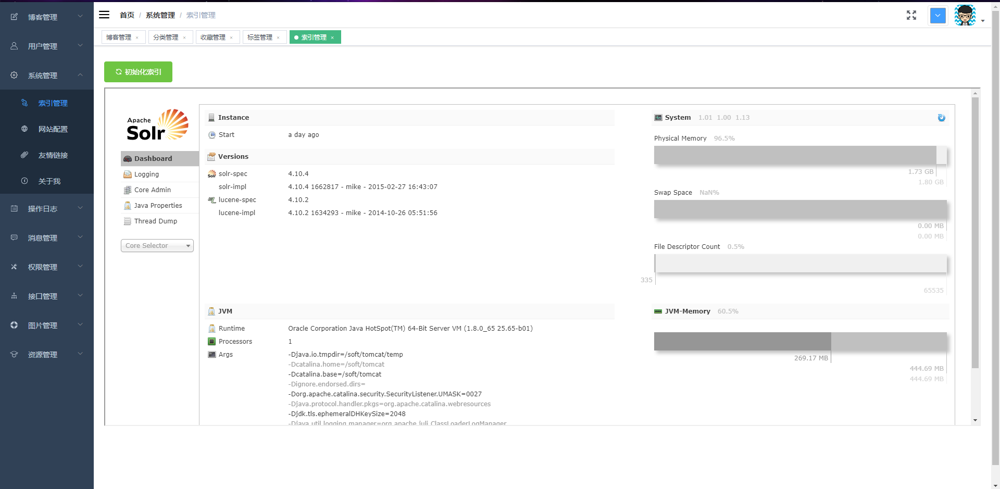

# 蘑菇博客

  

   蘑菇博客，一个基于微服务架构的前后端分离博客系统

  
<a target="_blank" href="https://www.oracle.com/technetwork/java/javase/downloads/index.html">
		</img>
	</a>

## 项目介绍
蘑菇博客，一个基于微服务架构的前后端分离博客系统。前台使用Vue +Element , 后端使用spring boot + spring cloud + mybatis-plus进行开发，使用  Jwt + Spring Security做登录验证和权限校验

- 从大学的时候开始，就一直想要搭建一套属于自己的博客系统，但是一直被没有去弄，现在时间多了，结合自己的技术栈，使用前后端分离架构进行项目的开发，也希望自己能够将项目一步步进行完善。
- 现在挺多是SSM或者SSH的博客管理系统，现在我想用spring boot + spring cloud  + vue 的微服务架构
- 由于原来做过vue + element-ui 做过管理系统，所以现在打算做一套自己的、基于当前最新技术栈、前后端分离的微服务博客系统。

## 目录介绍

- MoguBlog 是一款基于最新技术开发的多人在线、简洁的博客系统。
- mogu_admin: 是admin端API接口服务；
- mogu_web: 是web端API接口服务；
- mogu_eureka: 服务发现服务器；
- mogu_picture: 图片服务器，用于图片上传和下载；
- mogu_sms: 消息发送服务器，用于邮件和短信发送
- mogu_utils: 是常用工具类；
- mogu_xo: 是存放 Entity，Service，Dao层的
- mogu_base: 是一些Base基类
- mogu_config: 是存放一些配置
- doc: 是蘑菇博客的一些文档和数据库文件
- vue_mogu_admin：VUE的后台管理页面
- vue_mogu_web：VUE的前台页面

## 技术架构

- 后端采用的技术：SpringBoot、Spring cloud 、MyBatis-Plus、Spring Security + JWT、Solr, Redis , Mysql , Nginx , Swagger，RabbitMQ，阿里大鱼、RabbitMQ
- 前端采用的技术： Vue， Element， ES6， CKEditor

## 项目特点

- 友好的代码结构及注释，便于阅读及二次开发
- 实现前后端分离，通过Json进行数据交互，前端再也不用关注后端技术
- 页面交互使用Vue2.x，极大的提高了开发效率。
- 引入swagger文档支持，方便编写API接口文档
- 引入RabbitMQ消息队列，用于邮件和短信发送。

## Windows环境下搭建蘑菇博客

可以参考 [window环境下配置蘑菇博客环境](http://www.moguit.cn/#/info?blogUid=082ca226cf2e4103b0ffa6e6c13d7b14)

## Docker快速搭建蘑菇博客

​	可以参考 [这篇博客](http://www.moguit.cn/#/info?blogUid=ab8377106a0d4b9f8d66131e4312c69e)，能够快速在虚拟机中，搭建好博客系统  

## 项目环境

- 安装 JDK（1.8+）
- 安装 Maven (3.3.0+)
- 安装Redis服务 (3.0+)
- 安装 MySQL (5.6+)
- 安装 Solr （7.0+）
- 安装 RabbitMQ （3.7.4）
- 安装 Erlang (20.3) （安装RabbitMQ还需要Erlang）
- 安装 Nginx
- 安装IDE （推荐安装STS）

## 启动顺序

mogu_eureka ->  mogu_picture -> mogu_sts -> mogu_admin -> mogu_web

## 致谢

- 感谢杨青小姐姐的博客模板，http://www.yangqq.com/
- Vue项目参考这篇博客：https://segmentfault.com/a/1190000009506097
- 感谢苞米豆提供的Mybatis-plus框架：http://mp.baomidou.com/

## 相关截图

- ### admin端

  

  

  
  
  
  
  
  
  
  
  

  
  
  

  
  
  
  
  
  
  
  
  
  
  
  
  
  
  
  
  
  
  

  

- ### Web端

  

  
  
  

  

  

