# 常见问题汇总

以下收集了一些小伙伴在使用过程中遇到的一些场景问题

## 1、启动出现 I/O error on POSt request for "http://localhost:9411/api/v2/span" ：connect timeout

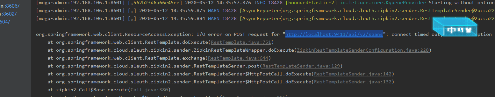

这是因为没有启动链路追踪服务 zipkin，不过不启动也没有关系，只在启动的时候出错一次，不影响正常的使用，如果需要引入，那么参考博客：[使用Zipkin搭建蘑菇博客链路追踪](http://moguit.cn/#/info?blogUid=35bd93cabc08611c7f74ce4564753ef9)

## 2、线上服务器内存太小，如何部署蘑菇博客

目前博主使用的服务器配置是1核2G，没有启动对应的监控组件和搜索服务，如 `zipkin`，`mogu_search`、`mogu-monitor`等

只启动了一些核心的服务，目前线上服务器最低要求需要的配置清单如下：

- `mogu-eureka`：服务注册与发现
- `mogu-picture`： 图片服务，用于图片上传和下载
- `mogu-sms`：消息服务，用于更新ElasticSearch、Solr索引、邮件和短信发送
- `mogu-web`：管理端服务，提供admin端API接口服务；
- `mogu-admin`：门户端服务，提供web端API接口服务；
- `mysql`：用于数据存储
- `redis`：缓存服务，用户存储热点数据
- `rabbitmq`：消息中间件
- `nginx`：静态资源映射和反向代理

关于具体各个模块的启动参考博客：[使用Docker快速搭建蘑菇博客](http://www.moguit.cn/#/info?blogUid=ab8377106a0d4b9f8d66131e4312c69e)

## 3、RabbitMQ在运行过程中突然宕机了怎么办？

有的时候查看项目日志的时候，会突然出现RabbitMQ连接失败的问题，这是因为RabbitMQ宕机了，docker容器中因为设置了rabbitmq的自启动，因此开启就会启动，但是如果宕机了，使用下面命令再次启动即可。`ps：目前宕机原因暂时没有发现，但是使用下面命令启动后，很少会出现宕机了“`

```
# 后台启动RabbitMQ
rabbitmq-server -detached
```

## 4、本地运行成功系统后，博客列表为什么没有图片显示？

本地运行成功后，没有图片，则需要我们手动进行图片上传，首先我们需要检查一下nginx是否成功启动，然后是否在nginx中添加了对应的映射，我们需要修改nginx.conf配置文件。

```
	#蘑菇博客图片资源
	server {
	listen       8600;
	server_name  localhost;	
	location / {
		root   D:\mogu_blog\data;
		index  index.html index.htm;
	}
	}
```

如果需要完整的nginx.conf，可以参考进入 .\doc\nginx\nginx.conf，将其替换即可

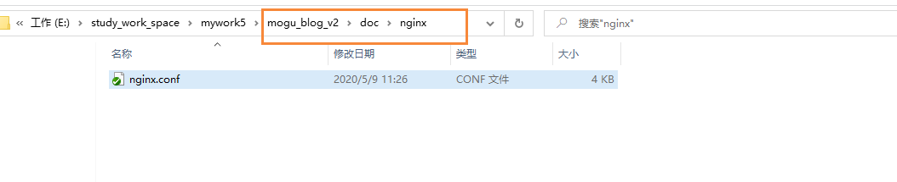

nginx没有问题后，我们就需要自己进入后台管理页面，手动上传图片

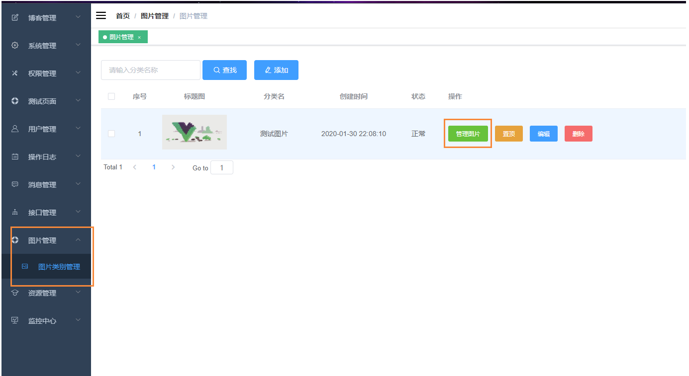

然后选择图片进行上传

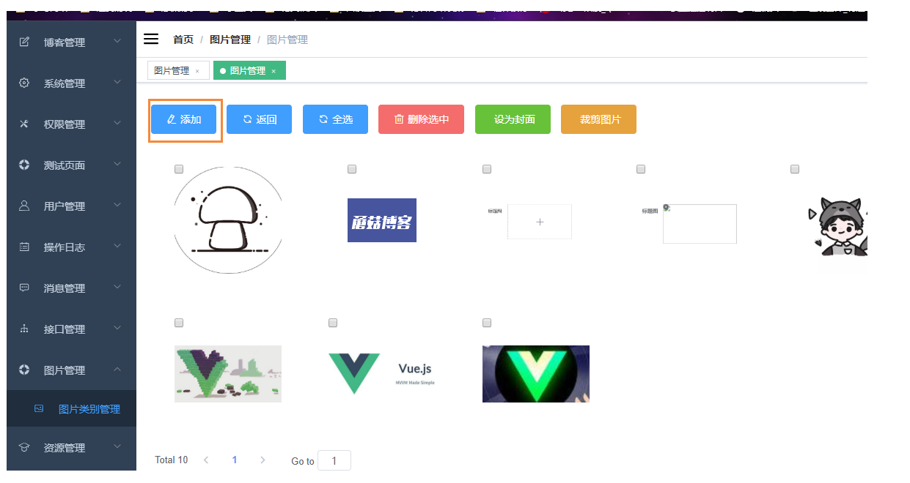

上传成功后，再到博客管理页面，修改博客标题图，然后保存即可

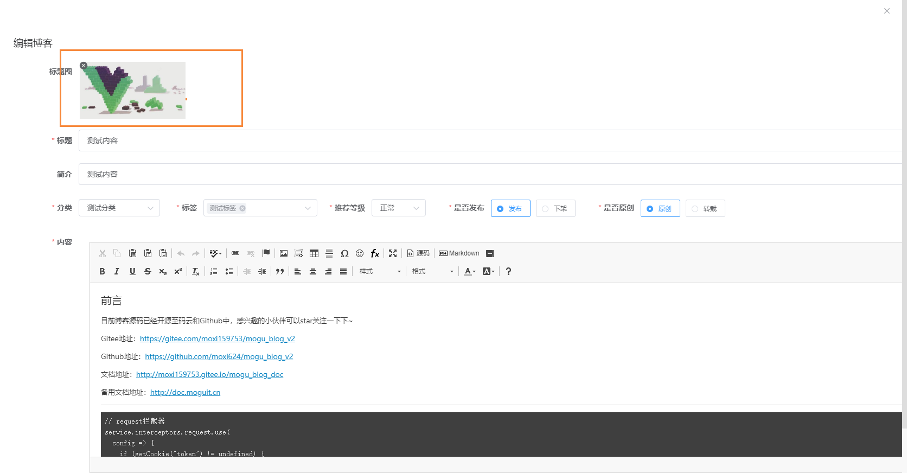

## 5、使用npm install命令安装依赖失败，出现node-sass错误

首先我们需要使用淘宝的npm镜像源镜像安装

```
# 安装依赖
npm install --registry=https://registry.npm.taobao.org
```

如果window用户出现`node-sass`安装失败，的问题，[解决方案](https://github.com/PanJiaChen/vue-element-admin/issues/24)。我们首先需要配置node-sass国内镜像源

```
# 指定node-sass的国内镜像源
npm i node-sass --sass_binary_site=https://npm.taobao.org/mirrors/node-sass

# 重新安装
npm install --registry=https://registry.npm.taobao.org
```


## 6、如何在蘑菇博客的基础上扩展新的模块，应该怎么做？

首先感谢群里小伙伴 @客官讲好简单 的反馈，目前假设小伙伴想要在扩展一个新的功能。

- 首先需要在 mogu_admin 下的 RestApi包中，添加一个类


然后需要在 vue_mogu_admin项目中，编写对应的页面

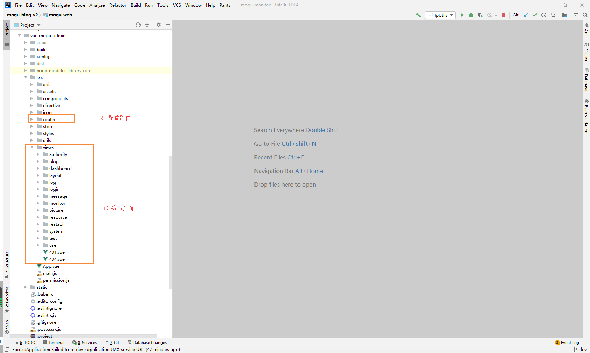

编写完成页面后，我们需要进入后台管理页面 下的 菜单管理，进行菜单的添加

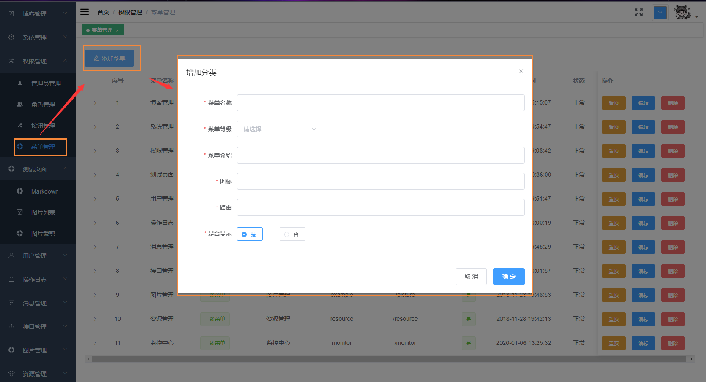


如果你的页面还有对应的按钮的话，比如 添加按钮，删除按钮，编辑按钮，那么还需要在按钮管理处配置

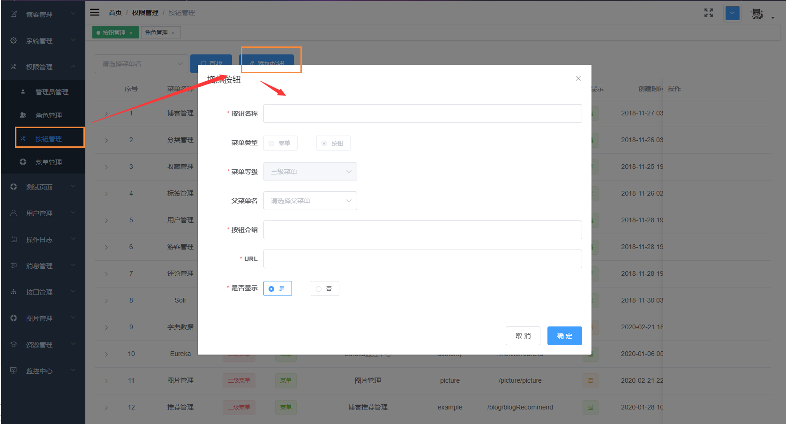

需要注意的是，在编写页面的时候，如果我们需要让没有权限的按钮，给隐藏起来的话，那么前端页面还需要配置一下 v-permission 指令，这里的值，对应的就是上面按钮管理里面的URL

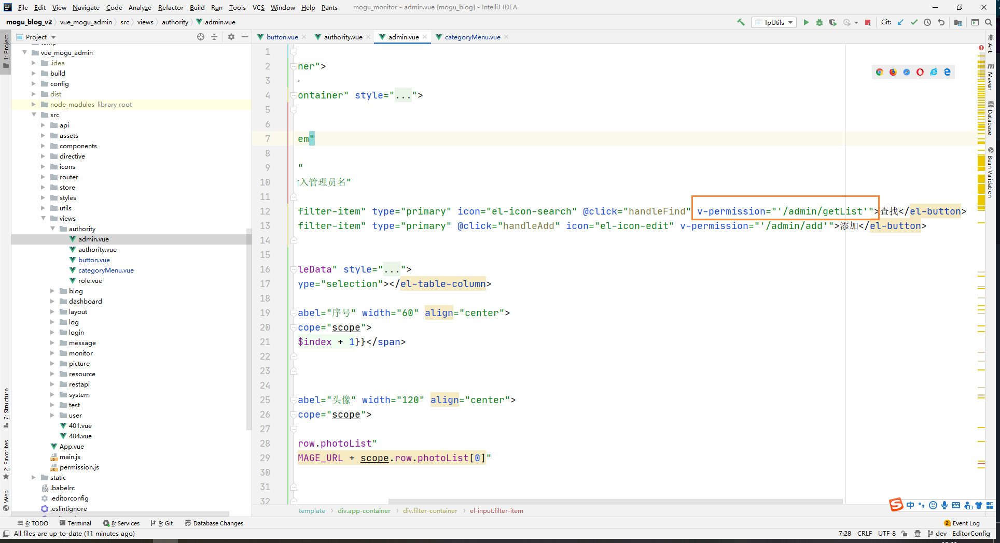

最后我们就需要进入后台管理的角色管理处，给我们的超级管理员，添加刚刚我们的页面以及对应的按钮

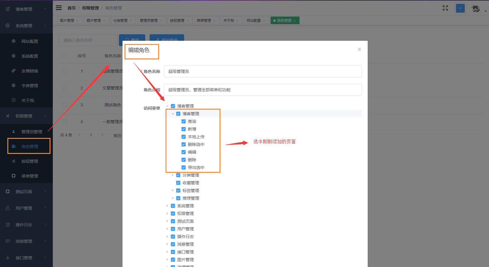

然后保存，刷新页面或者重新登录后，就能够看到我们添加后的菜单了~，如果出现以下问题，那么说明没有添加按钮。

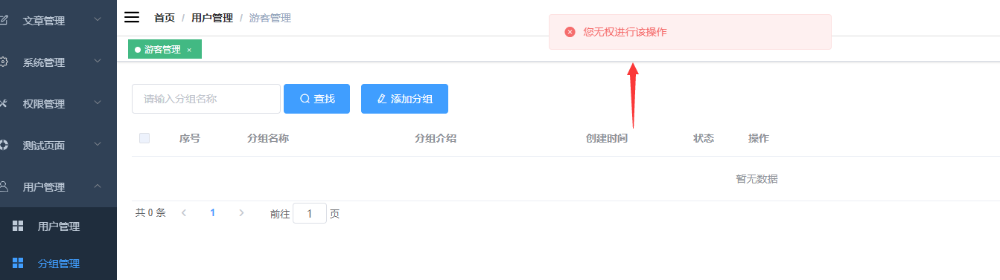