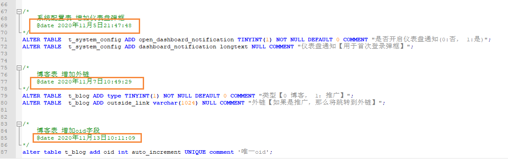

## 数据库文件说明

## 目录

- mogu_blog.sql：代表mogu_blog数据库的文件
- mogu_blog_update.sql：代表mogu_blog在后续开发时候更新的字段==（首次无需导入）==
- mogu_picture.sql：代表mogu_picture数据库文件
- mogu_picture_update.sql：代表mogu_picture在后续开发时候更新的字段==（首次不需要导入）==
- nacos_config.sql：代表nacos的配置信息，用来存放每个模块的配置信息

## 注意

- **首次导入数据库**文件的时候，我们**只需要执行`mogu_blog.sql` 、 `mogu_picture.sql`、`nacos_config.sql`**即可！！

- 如果你在之前已经部署了本项目，那么你需要在对应的update.sql文件中，打开后，从中找到没有的字段，复制上执行即可，里面每个字段的添加，都会有对应的日期提示，如果有些字段是你clone项目后添加的，那么你就需要执行它们一遍即可

- 【举例】假设我在2020.10.15号部署了项目，那会只需要通过导入 mogu_blog.sql 、mogu_picture.sql 和 nacos_config.sql 导入到数据库即可成功运行。但是后面在 2020.11.17号，又重新拉取了蘑菇博客的源码，企图重新更新项目，那么这个时候就有两种情况

  - 如果你系统里面没有任何数据【也就是没有添加自己的博客】，那么再次 导入 mogu_blog.sql 、mogu_picture.sql 即可
  - 如果你系统已经上线【已经添加了自己的一些内容】，那么就需要查看 mogu_picture_update.sql 和 mogu_picture_update.sql，然后查看在 2020.10.15  - 2020.11.17 这一段时间内，是否更新了新的字段，如果有更新，那么为了不破坏原有的数据库，那么你需要把里面的字段插入到执行的数据库表中

  每次更新的时间，在mogu\_\*_update.sql 表里都有体现，只需要进去查看即可

  